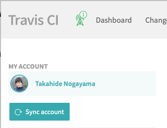
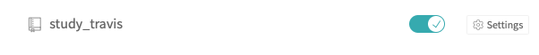

# Study Travis


1. create github repository => `study_travis`

2. add  `.travis.yml`  ファイル名が一字一句合ってる必要あり

    ```yaml
    language: bash
    script:
    - echo hello
    ```

3. dir
    ```
    ├── .travis.yml
    └── tests
        └── mytest.sh
    ```

4. https://travis-ci.org にログイン

5. sync accountをクリックし，Githubの情報を取得

    

6. オンにする

    

7.  自動的に，webhookがオンになる

    

8. pushするたび，テストが travis で実行される


## APIでビルドをトリガーする

1. TravisのプロファイルからTokenをコピーする

2. curlで以下のものを送る

``
body='{
"request": {
"branch":"master"
}}'

curl -s -X POST \
   -H "Content-Type: application/json" \
   -H "Accept: application/json" \
   -H "Travis-API-Version: 3" \
   -H "Authorization: token XXXX" \
   -d "$body" \
   https://api.travis-ci.org/repo/nogayama%2Fstudy_travis/requests
```
